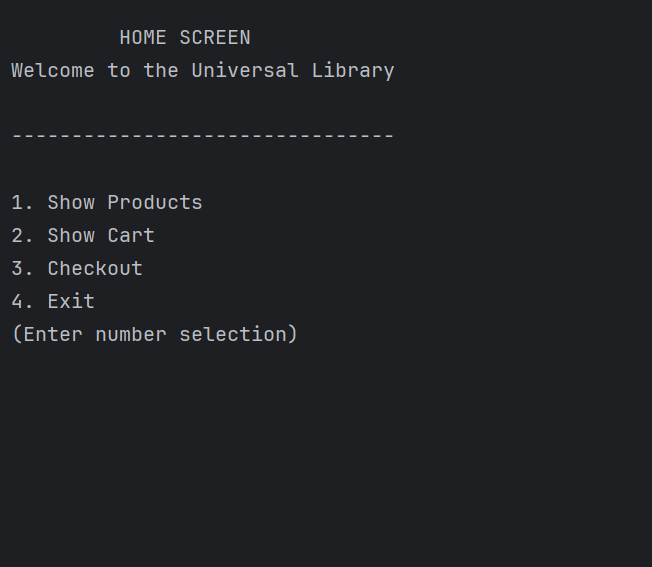

# Online Store

## Description of the Project

Online Store is a Java console-based application that simulates a simple e-commerce shopping experience. The application allows users to browse products, add items to a shopping cart, and complete purchases using a simulated cash checkout system. Product information is loaded from a CSV file. This project is ideal for demonstrating file I/O, collections, and object-oriented design in Java.

## User Stories

- As a user, I want to see a home menu with clear options, so I can navigate the store easily.
- As a user, I want to view all products available in the store, so I can browse what I might buy.
- As a user, I want to search for a product by ID, so I can quickly locate specific items.
- As a user, I want to add products to my shopping cart, so I can keep track of what I intend to purchase.
- As a user, I want to view the contents of my cart and see a running total, so I know how much I’m spending.
- As a user, I want to remove items from my cart (optional enhancement), so I can update my purchase decisions.
- As a user, I want to proceed to checkout, so I can complete my purchase.
- As a user, I want to enter my payment and receive a receipt with a breakdown and my change, so I have a confirmation of the transaction.

## Setup

Instructions on how to set up and run the project using IntelliJ IDEA.

### Prerequisites

- IntelliJ IDEA: Download it from [here](https://www.jetbrains.com/idea/download/).
- Java SDK: Ensure Java SDK 17+ is installed and configured in IntelliJ.

### Running the Application in IntelliJ

1. Open IntelliJ IDEA.
2. Click **File > Open** and select the directory where you cloned this project.
3. Wait for IntelliJ to finish indexing and loading dependencies.
4. Locate the `main()` method (usually in `OnlineStore.java` or similar).
5. Right-click the file and choose **Run** to start the program.

## Technologies Used

- Java: Java SE Development Kit 17
- `java.util.*` — Collections (ArrayList, Scanner), Input handling
- `java.io.*` — File I/O (BufferedReader, FileReader)
- `java.text.*` or `java.time.*` — Optional formatting utilities

## Demo

## Future Works

Potential future enhancements for this project include:

- Add product quantity and stock limits
- Save cart state to a file for persistent sessions
- Build a GUI with JavaFX or Swing
- Enable coupon codes or discount systems
- Enable sorting/filtering options for products

## Resources

- [Java File I/O - Oracle Docs](https://docs.oracle.com/javase/tutorial/essential/io/)
- [Java Collections Framework](https://docs.oracle.com/javase/8/docs/technotes/guides/collections/)
- [Baeldung Java Tutorials](https://www.baeldung.com/java)

## Team Members

- Guriqbal Manyani (Myself) – Developer
- Instructor Raymond Maroun

## Thanks

Special thanks to Professor Raymond Maroun for teaching the concepts behind this project and offering guidance along the way.

